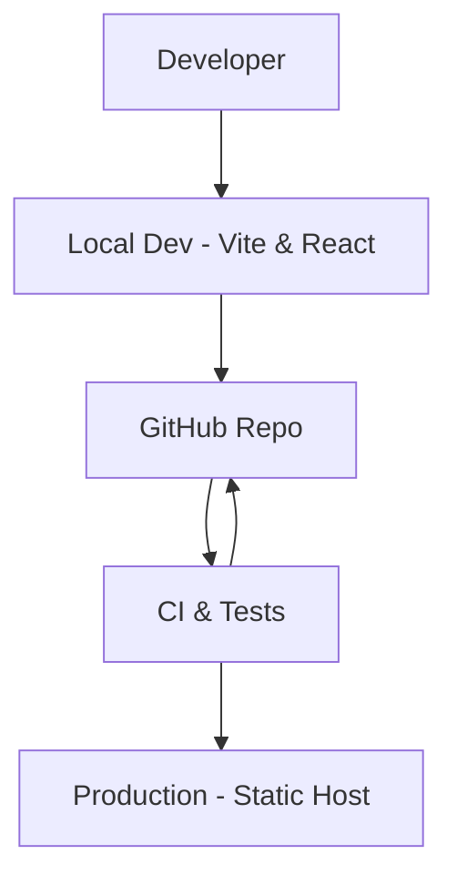
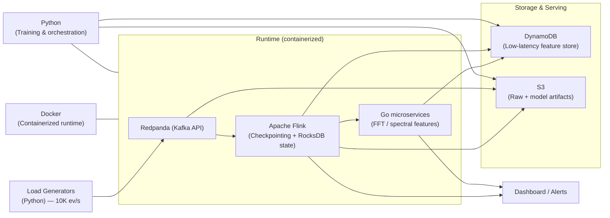

# MALAI Sentinel Flow

A modern frontend scaffold built with React, Vite, and Tailwind CSS — optimized for fast development, maintainable UI, and production-ready builds.

> Clean starter for building responsive, accessible, and highly-performant web user interfaces.


## Table of Contents

- [Overview](#overview)
- [Key Features](#key-features)
- [Architecture](#architecture)
- [Streaming Architecture & Experiment](#streaming-architecture--experiment)
- [Getting Started](#getting-started)
  - [Prerequisites](#prerequisites)
  - [Quick Start (Windows CMD)](#quick-start-windows-cmd)
  - [Development Workflow](#development-workflow)
- [Project Structure](#project-structure)
- [Styling and Theming](#styling-and-theming)
- [Testing & Linting](#testing--linting)
- [Deployment](#deployment)
- [Contributing](#contributing)
- [License](#license)
- [Contact](#contact)


## Overview

MALAI Sentinel Flow is a frontend template and development scaffold that combines:

- Vite for a lightning-fast dev server and optimized builds
- React for composable UI and modern patterns (hooks, concurrent-ready)
- Tailwind CSS for utility-driven, consistent styling

This repository is meant to be a starting point for new applications — providing a minimal, well-documented foundation so teams can focus on delivering features instead of configuration.


## Key Features

- ⚡ Fast development with Vite and HMR (Hot Module Replacement)
- ⚛️ Modern React (function components + hooks)
- 🎨 Tailwind CSS for consistent, utility-first styling
- 📦 Production-ready build pipeline
- 🧰 Opinionated defaults for structure and developer ergonomics


## Architecture

The project is intentionally simple and front-end focused. The diagram below shows the high-level flow between developer, local environment, CI, and production.

Note: GitHub's Mermaid renderer can be strict about syntax. If you see a render error on GitHub, use the ASCII fallback shown below.



Fallback ASCII diagram (renders anywhere):

Developer -> Local (Vite + React + Tailwind)
Local -> GitHub (push)
GitHub -> CI (build/test)
CI -> Production (deploy static assets)


## Streaming Architecture & Experiment

This repository also documents a streaming experiment and local prototype used to validate real-time telemetry processing for wind turbines.

Key experiment highlights

- Processed synthetic wind-turbine telemetry (vibration, rotor speed, gearbox temperature) using a local Flink cluster and Redpanda, simulating 10K events/sec via load generators.
- Implemented FFT-based feature extraction and lightweight Go microservices for real-time spectral analysis, achieving ~2× faster computation under these simulated workloads.
- Designed fault-tolerant stream processors with checkpointing and state replication on a minimal free-tier setup, improving pipeline stability during bursty input loads.


Architecture diagram (Mermaid - GitHub-friendly)



ASCII fallback (renders anywhere)

- Load Generators (Python) simulate 10K events/sec -> Redpanda (Kafka API)
- Redpanda buffers events -> Apache Flink processes streams (checkpointing, RocksDB state)
- Flink outputs:
  - Real-time spectral features via Go microservices (FFT) -> DynamoDB (low-latency store)
  - Enriched streams & raw batches -> S3 (archive & ML training)
  - Metrics/alerts -> Dashboard
- Docker packages Flink, Redpanda, and microservices for consistent local/mini-cloud deployment
- Python used for load generation, offline model training, orchestration, and glue logic


Justification: why these components were chosen

- Apache Flink
  - Purpose: Stateful stream processing with low-latency windowing, built-in checkpointing, and exactly-once semantics.
  - Benefits: Stable state management (RocksDB), fast recovery using incremental checkpoints, ideal for bursty telemetry and long-running windows used by FFT and aggregations.

- Kafka / Redpanda
  - Purpose: Durable, partitioned event bus to decouple producers and consumers and absorb high ingestion rates.
  - Benefits: Redpanda is Kafka-compatible and lightweight for local clusters (no JVM), enabling sustained 10K ev/s ingestion and replay for correctness testing.

- DynamoDB
  - Purpose: Low-latency key-value store for serving latest features, anomaly flags, or per-turbine state to dashboards and microservices.
  - Benefits: Managed scaling and low read latency make it suitable as a feature-serving layer in experiments and prototypes.

- S3
  - Purpose: Cost-effective, durable object store for raw telemetry archives, enriched batches, and model artifacts / checkpoints.
  - Benefits: Enables reprocessing and offline training from the same historical data used for online inference.

- Docker
  - Purpose: Containerize Flink, Redpanda, Go microservices, and Python tools to ensure reproducible local and CI environments.
  - Benefits: Simplifies deployment and benchmarking across machines and CI runners.

- Python
  - Purpose: Fast development for load generators, orchestration, and offline model training pipelines.
  - Benefits: Rich ecosystem of ML libraries and quick iteration for experiments.

- Go (FFT microservices)
  - Purpose: Efficient, compiled microservices for CPU-bound FFT-based feature extraction with low latency.
  - Benefits: In our experiment Go services performed ~2× faster than heavier runtimes, enabling real-time spectral feature extraction at tested throughput.


Operational recommendations for stability

- Flink
  - Use RocksDB state backend with incremental checkpoints; externalize checkpoints to S3 for persistent recovery.
  - Checkpoint interval: 5–15s (tune for trade-offs between latency and recovery time).
  - Match Flink parallelism and task slots to CPU cores of host containers.

- Redpanda/Kafka
  - Partition topics to match Flink parallelism; enable batching and compression to improve throughput.
  - In production, use replication factor >=2; for minimal experiments use RF=1 but persist critical raw topics to S3.

- DynamoDB
  - Use on-demand or provisioned throughput depending on traffic; use TTL for ephemeral entries.

- Docker / Local topology
  - Use docker-compose for local clusters (JobManager/TaskManager, brokers, microservices). Offload large persistent state to S3 to avoid host disk limitations.


Suggested metrics to validate results

- End-to-end latency (p50/p95/p99) from ingestion -> DynamoDB write or dashboard update.
- Sustained throughput and behavior under bursts (10K ev/s sustained and burst recovery).
- CPU / memory usage for Flink TaskManagers, Redpanda, and Go FFT microservices.
- Time-to-recover (from checkpoint) and data loss probability under node failures.


## Getting Started

### Prerequisites

- Node.js 16+ (LTS recommended)
- npm (bundled with Node) or yarn / pnpm


### Quick Start (Windows CMD)

Open Command Prompt (cmd.exe) and run the following commands inside your project folder.

If you have an existing local folder and want to push it to the repository (fresh history):

cd /d C:\path\to\your-folder
git init
git add .
git commit -m "Initial commit"
git branch -M main
git remote add origin https://github.com/ShaikYasir/MALAI-Sentinel-Flow-.git
git push -u origin main

If you want to clone the existing repository and copy your files into it:

cd /d C:\
git clone https://github.com/ShaikYasir/MALAI-Sentinel-Flow-.git
cd MALAI-Sentinel-Flow-
rem copy files from source to this directory, e.g. using robocopy
robocopy "C:\path\to\your-folder" "%CD%" /E

Install dependencies and run the dev server:

npm install
npm run dev

The app will be available at http://localhost:5173/


### Development Workflow

- Run `npm run dev` for local development with HMR
- Commit changes and push to GitHub
- CI runs build & tests (if configured)
- Merge to the main branch for production deploy


## Project Structure

```
src/
├── main.jsx        # Application entry (Vite)
├── App.jsx         # Root React component
├── index.css       # Tailwind directives and global styles
├── assets/         # Images, fonts and static files
└── components/     # Reusable UI components

public/             # Static files served as-is (optional)
package.json
tailwind.config.js
postcss.config.mjs
README.md
```


## Styling and Theming

- Tailwind is configured in `tailwind.config.js` with content paths set to `src/` so utilities are purged in production.
- Edit `theme.extend` in `tailwind.config.js` to add custom colors, spacing, or fonts.
- Use `@apply` in component-specific CSS if you need to compose utility classes into semantic classes.


## Testing & Linting

This template includes placeholders for ESLint and testing configuration. Add or enable the tools your team uses (Jest, Vitest, Playwright, etc.).

Recommended steps:

- Add unit tests with Vitest (integrates well with Vite)
- Configure ESLint + Prettier for consistent code style


## Deployment

Because this is a static frontend, recommended hosts include:

- Vercel — automatic deployments from GitHub branches
- Netlify — static hosting with redirects & edge functions
- GitHub Pages — for simple static sites

Build the production assets with:

npm run build

Then follow your host's instructions to deploy the `dist/` (or `build/`) output.


## Contributing

Contributions are welcome. Suggested workflow:

1. Fork the repository
2. Create a feature branch: `git checkout -b feat/your-feature`
3. Make changes and add tests
4. Commit and push: `git push origin feat/your-feature`
5. Open a Pull Request describing your changes

Be sure to follow consistent commit messages and include a clear PR description.


## License

This project is licensed under the MIT License. See the LICENSE file for details.


## Contact

Maintainer: ShaikYasir

For issues or feature requests, please use GitHub Issues in this repository.


---

README updated: added streaming architecture diagram, experiment highlights, component justification (Flink, Redpanda/Kafka, DynamoDB, S3, Docker, Python, Go), and operational recommendations.
